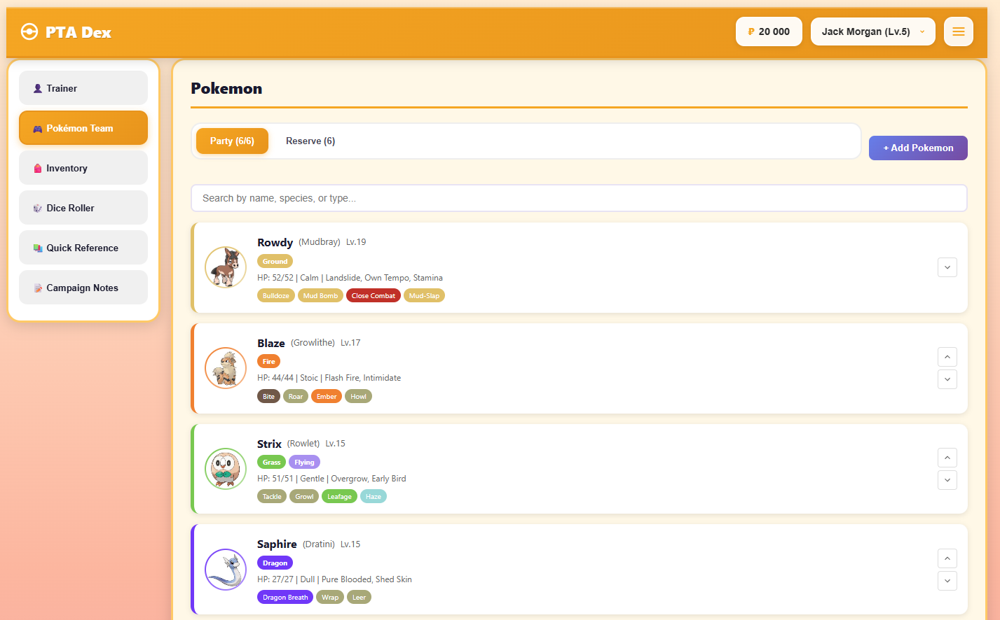

# PTA Dex — Pokémon Tabletop Adventures Character Manager

A fan-made, non-commercial web application for managing trainers, Pokémon, stats, moves, and game data for the **Pokémon Tabletop Adventures (PTA)** tabletop RPG system.

This tool replaces spreadsheets and manual note-taking with a clean, interactive interface designed for long-running PTA campaigns.



> **Live Demo:** [https://leander-r.github.io/pta-dex/](https://leander-r.github.io/pta-dex/)

---

## Features

### Trainer Management
- **Profile & Stats** — Track trainer name, age, level, HP, and core stats (STR, DEX, CON, INT, WIS, CHA)
- **Classes & Features** — Manage trainer classes with their associated features and abilities
- **Skills** — Full skill system with modifiers and proficiency tracking
- **Money Tracking** — Keep track of your Pokédollars (₽)

### Pokémon Team
- **Full Party Management** — Add, edit, and organize your Pokémon team
- **Stat Calculations** — Automatic stat calculations based on level, nature, base stats, and IVs
- **Move Management** — Track known moves with full move data (type, damage, accuracy, effects)
- **Evolution Tracking** — View evolution chains and track evolution progress
- **Abilities** — Manage Pokémon abilities with full descriptions
- **Regional Forms** — Support for Alolan, Galarian, Hisuian, and Paldean forms
- **Custom Moves** — Create homebrew moves for your campaign

### Battle Tools
- **Dice Roller** — Roll for Pokémon moves, trainer skills, or custom dice
- **Combat Stages** — Track stat modifiers (-6 to +6) during battle
- **STAB Calculator** — Automatic Same-Type Attack Bonus calculations
- **HP Tracking** — Track current HP and damage for each Pokémon
- **Discord Integration** — Send roll results directly to Discord via webhooks

### Inventory System
- **Item Management** — Add, remove, and track item quantities
- **Item Database** — Browse and search the full PTA item database
- **Category Filters** — Filter by item type (Healing, Poké Balls, Held Items, etc.)
- **Quick Search** — Find items instantly with search

### Quick Reference
- **Type Chart** — Interactive type effectiveness chart
- **Natures** — Complete nature reference with stat modifiers
- **Moves Database** — Searchable database of all moves
- **Abilities Database** — Browse all Pokémon abilities
- **EXP Chart** — Experience requirements by level
- **Game Rules** — Quick reference for common PTA rules

### Notes
- **Campaign Notes** — Keep session notes, plot points, and reminders
- **Per-Trainer Notes** — Each trainer has their own notes section

### Data Management
- **Auto-Save** — All changes saved automatically to local storage
- **Export/Import** — Export trainer data as JSON for backup or sharing
- **Card Export** — Export Pokémon cards as images
- **Multi-Trainer Support** — Manage multiple trainers/characters

### User Experience
- **Responsive Design** — Works on desktop, tablet, and mobile devices
- **Offline Support** — Fully client-side, no server required
- **Modern UI** — Clean, Pokémon-themed interface with smooth animations

---

## Tech Stack

| Technology | Purpose |
|------------|---------|
| **React 18** | UI framework |
| **Vite** | Build tool & dev server |
| **html2canvas** | Card image export |
| **CSS3** | Styling with CSS variables |
| **LocalStorage** | Data persistence |
| **IndexedDB** | Pokédex data caching |

---

## Getting Started

### Use Online (Recommended)

Visit the live site: **[https://leander-r.github.io/pta-dex/](https://leander-r.github.io/pta-dex/)**

No installation required — works in any modern browser.

### Run Locally

#### Prerequisites
- [Node.js](https://nodejs.org/) (v18 or higher recommended)
- npm (comes with Node.js)

#### Installation

```bash
# Clone the repository
git clone https://github.com/leander-r/pta-dex.git

# Navigate to the project directory
cd pta-dex

# Install dependencies
npm install

# Start the development server
npm run dev
```

The app will be available at `http://localhost:5173`

#### Build for Production

```bash
# Create production build
npm run build

# Preview production build
npm run preview
```

---

## Usage Guide

### Creating Your First Trainer

1. The app starts with a default trainer — click on the **Trainer** tab
2. Edit your trainer's name, age, and description
3. Allocate stat points (STR, DEX, CON, INT, WIS, CHA)
4. Choose your trainer classes and features
5. Assign skill points

### Adding Pokémon to Your Team

1. Go to the **Pokémon** tab
2. Click **Add Pokémon**
3. Search for a Pokémon by name
4. Set its level, nature, and nickname
5. The stats will be calculated automatically
6. Add moves from the move pool

### Using the Dice Roller

1. Go to the **Battle** tab
2. Select a Pokémon from your party
3. Click on a move to roll damage
4. Or switch to **Trainer** mode to roll skill checks
5. Results appear in the roll history

### Managing Multiple Trainers

1. Click the **menu button** (☰) in the header
2. Select **New Trainer** to create a new character
3. Use the **trainer dropdown** in the header to switch between trainers
4. Use **Clone Trainer** to duplicate an existing character

### Exporting Your Data

1. Click the **menu button** (☰) in the header
2. **Export Trainer JSON** — Save current trainer as JSON file
3. **Export All Data** — Backup all trainers
4. **Export Cards** — Export Pokémon as image cards
5. **Import Data** — Restore from a JSON backup

---

## Project Structure

```
pta-dex/
├── src/
│   ├── components/
│   │   ├── battle/        # Dice roller & combat tools
│   │   ├── common/        # Header, notifications, etc.
│   │   ├── inventory/     # Item management
│   │   ├── modals/        # Modal dialogs
│   │   ├── notes/         # Notes system
│   │   ├── pokemon/       # Pokémon cards & management
│   │   ├── reference/     # Type chart, moves, abilities
│   │   └── trainer/       # Trainer profile & stats
│   ├── contexts/          # React context providers
│   ├── data/              # Game data & configurations
│   ├── hooks/             # Custom React hooks
│   ├── styles/            # Global CSS styles
│   └── utils/             # Utility functions
├── pokedex.min.json       # Pokémon data
├── pta-game-data.min.json # PTA game rules data
└── index.html             # Entry point
```

---

## Contributing

Contributions are welcome! Here's how you can help:

### Reporting Bugs

1. Check if the issue already exists in [GitHub Issues](https://github.com/leander-r/pta-dex/issues)
2. If not, create a new issue with:
   - Clear description of the bug
   - Steps to reproduce
   - Expected vs actual behavior
   - Browser and device information

### Suggesting Features

1. Open a [GitHub Issue](https://github.com/leander-r/pta-dex/issues) with the "enhancement" label
2. Describe the feature and why it would be useful

### Submitting Code

1. Fork the repository
2. Create a feature branch (`git checkout -b feature/your-feature`)
3. Make your changes
4. Test thoroughly
5. Commit with clear messages
6. Push to your fork
7. Open a Pull Request

### Code Style

- Use functional React components with hooks
- Follow existing naming conventions
- Keep components focused and modular
- Add comments for complex logic

---

## License

This project is for **personal, non-commercial use only**.

### Trademark Notice

Pokémon, Pokémon character names, Nintendo, Game Freak, and all related marks are trademarks, registered trademarks, or copyrights of Nintendo, Game Freak, Creatures Inc., and The Pokémon Company.

This is an **unofficial fan-made tool** and is not affiliated with, endorsed by, or connected to Nintendo, Game Freak, The Pokémon Company, or the creators of Pokémon Tabletop Adventures.

---

## Credits

- **Developer:** [leander_rsr](https://github.com/leander-r)
- **PTA System:** The Pokémon Tabletop Adventures community
- **Pokémon Data:** Compiled from various community sources
- **AI Assistance:** Development aided by AI tools for iteration, refactoring, and UI improvements

---

## Support

If you encounter issues or have questions:

- Open an issue on [GitHub](https://github.com/leander-r/pta-dex/issues)
- Check existing issues for solutions

---

*Made with ❤️ for the PTA community*
